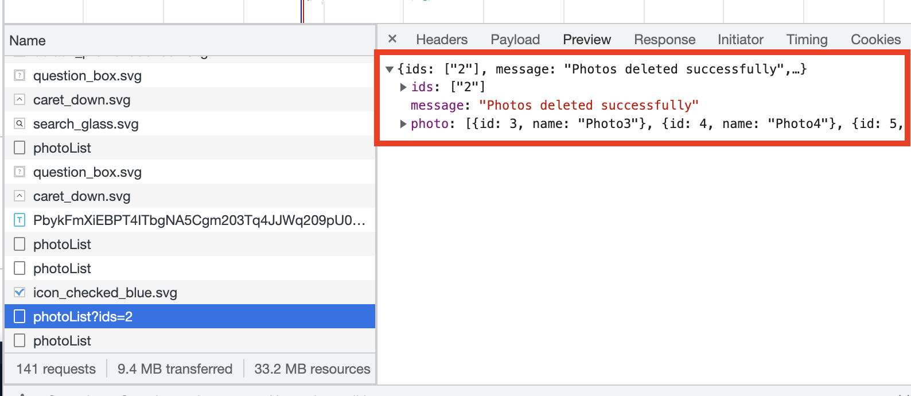

### tanstack query

> useMutation으로 photo Delete 구현 중 캐시가 업데이트에 문제가 생김

```TSX
export const useDeletePhotoListQuery = (): UseMutateFunction<
  void,
  unknown,
  { selectedPhotoIds: string },
  unknown
> => {
  const queryClient = useQueryClient();
  const { mutate } = useMutation(
    ({ selectedPhotoIds }: { selectedPhotoIds: string }) =>
      deletePhotoList({ selectedPhotoIds }),
    {
      onSuccess: (newData) => {
        // queryClient.setQueriesData([queryKeys.photoList], newData); // 자동으로 업데이트 되긴 함.
        queryClient.invalidateQueries([queryKeys.photoList]); // 수동으로 트리거 시켜주어야 캐시가 업데이트 됨.
      },
    },
  );

  return mutate;
};
```

<br>

2번 photo를 삭제했으나,


<br>

delete 이후 데이터를 가져오면 캐시 무효화가 되지 않았음.


- invalidateQueries가 정상적으로 동작하지 않음
  - photoData를 delete하는 버튼을 클릭하고 난 이후, invalidateQueries가 re-fetch 트리거를 거는 걸로 알고 있는데,
    1. refetch 되지만, 기존 50개의 데이터를 그대로 가져옴
    2. refetch 되지 않고, 수동으로 트리거를(refetchOnWindow) 걸어주면 50개에서 49개로 변경 됨.

<br>

### 해결

> 프론트 코드에는 이상 없었음.

```TSX
import { NextApiRequest, NextApiResponse } from 'next';
import fs from 'fs';

// import photoList from 'pages/api/photo/photo.json';
const photoList: Photo[] = JSON.parse(
    fs.readFileSync('pages/api/photo/photo.json', 'utf-8'),
);

export default function handler(req: NextApiRequest, res: NextApiResponse) {
  if (req.method === 'GET') {
    return res.status(200).json({ photo: photoList });
  }

  if (req.method === 'DELETE') {
    try {
      const ids = (req.query.ids as string).split(',');
      const result = photoList.filter((x) => !ids.includes(String(x.id)));

      fs.writeFileSync('pages/api/photo/photo.json', JSON.stringify(result));

      res.status(200).json({
        ids: ids,
        message: 'Photos deleted successfully',
        photo: result,
      });
    } catch (err) {
      res.status(500).send({ error: err });
    }
  }
}
```

- DB를 import로 불러오면 파일이 불러올 때만 데이터가 업데이트 됨
- 하지만 fe.readFileSync()로 불러오면 API endpoint가 호출될 때마다 최신 버전의 photo.json 파일이 로드 됨
- 하지만 import로 불러오면 파일에서 가져온 기본값을 사용하므로, photoList 데이터가 한 번 로드되고 서버가 다시 시작될 때까지 다시 업데이트 되지 않음.

<br>
