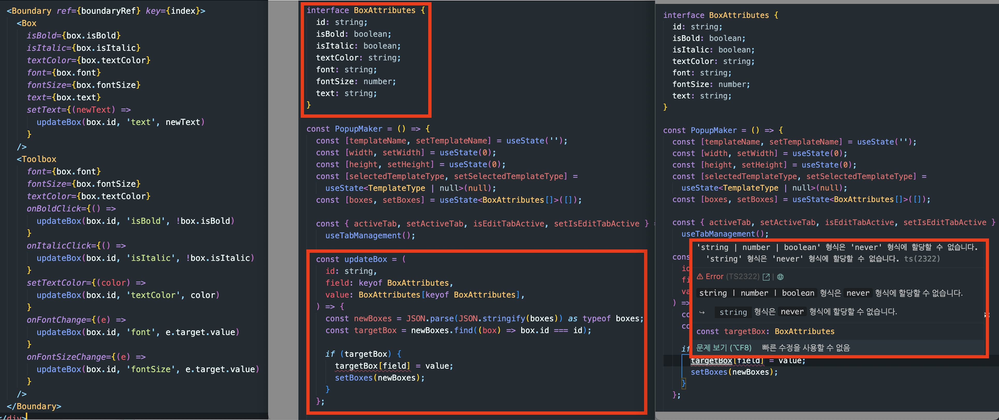

* 블로그에 올라가 있는 내용 수정할 것
  * 잘못된 정보 수정하기

[git mv and only change case of directory](https://stackoverflow.com/questions/3011625/git-mv-and-only-change-case-of-directory)

<br>




```TSX
const updateBox = (
    id: string,
    field: keyof BoxAttributes,
    value: BoxAttributes[keyof BoxAttributes],
  ) => {
    setBoxes((prevBoxes) => {
      return prevBoxes.reduce((acc, box) => {
        if (box.id === id) {
          const updatedBox = {
            ...box,
            [field]: value,
          };

          acc.push(updatedBox);
        } else {
          acc.push(box);
        }

        return acc;
      }, []);
    });
  };

  const updateBox = (
    id: string,
    field: keyof BoxAttributes,
    value: BoxAttributes[keyof BoxAttributes],
  ) => {
    setBoxes((prevBoxes) => {
      return prevBoxes.map((box) =>
        box.id === id ? { ...box, [field]: value } : box,
      );
    });
  };

```