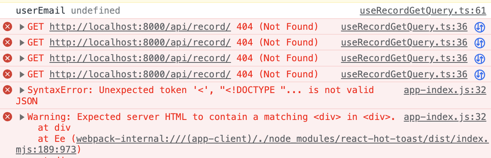

### Hydration Error



- 위와 같은 에러가 떴는데, 왜 뜬걸까?
- log를 확인해보면, useQuery에서 fetch가 원활히 동작하지 않는 듯 했다.
- 문제 없을 텐데,,, 하며 확인해본 결과 email를 인자로 넣어주는데, 이것 또한 useSession hooks으로 가져와야한다.
- useSession hooks으로 받아 온 후, useQuery에 넣어줘야하니, 그 사이에 undefined이다.
- 그럼 useQuery에선 email이 없다면 동작하지 않아야하는데, 동작한다.
- 왜그럴까...? 찾아본 결과 enabled를 지웠었다...
- enabled를 넣어주니 잘 동작한다.

<br>

```TSX
export interface Message {
  id: string;
  text: string;
  createdAt: string;
  title: string;
  image: Image[];
}

const decodeMessages = (message: Message): Message => {
  return {
    ...message,
    text: decodeURIComponent(message.text),
    title: decodeURIComponent(message.title),
  };
};

const getMessage = async (
  userEmail: string | null | undefined,
  token: string | undefined,
) => {
  const encodedEmail = encodeURIComponent(userEmail || '');
  const res = await fetch(
    `${process.env.NEXT_PUBLIC_SERVER_URL}/api/record/${encodedEmail}`,
    {
      method: 'GET',
      headers: {
        authorization: `Bearer ${token}`,
      },
    },
  );

  if (!res.ok) {
    const { message, status } = await res.json();
    throw new FetchError(message, status);
  }

  const data = await res.json();
  const decodedData = data.map(decodeMessages);

  return decodedData;
};

export const useRecordGetQuery = (
  userEmail: string | null | undefined,
  token: string | undefined,
) => {
  console.log('userEmail', userEmail);
  const messages = useQuery({
    queryKey: [...recordManagerKeys.record, userEmail],
    queryFn: () => getMessage(userEmail, token),
    enabled: !!userEmail,
    useErrorBoundary: (error: any) => {
      return error.status >= 500;
    },
  });

  return { messages };
};
```

- 하지만 이 방법 외에 중간 계층을 하나 더 둔 상태로 useSession hooks을 처리하는 컴포넌트에서 Suspense로 묶어주고,

* 그 하위 계층 또한 Suspense로 묶어줘도 됐을 것 같다.
* 테스트해봐야겠다.
