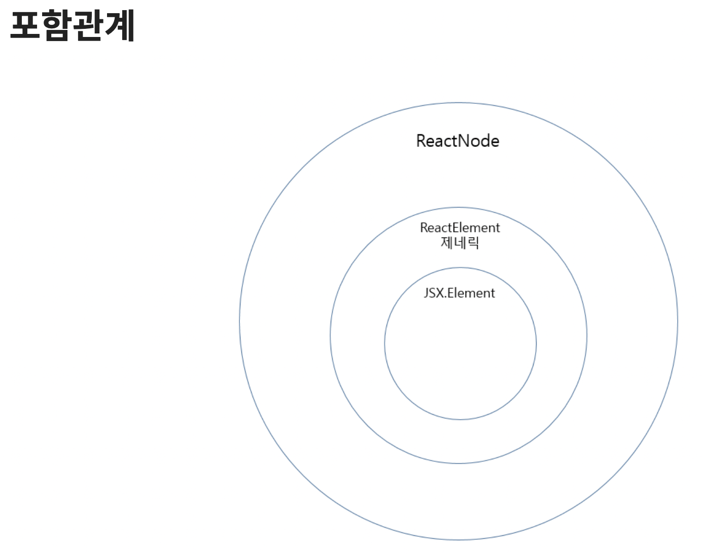

# React

## ReactElement vs ReactNode vs JSX.Element

> Typescript + react로 코드를 작성하다보면, 컴포넌트 타입을 지정해줘야할 때가 있음.

<br>

- 클래스 컴포넌트는 render메서드에서 `ReactNode`를 리턴함.
- 함수형 컴포넌트는 `ReactElement`를 리턴해줌.
- JSX는 바벨에 의해 `React.createElement(component, props, ...children)` 함수로 트랜스파일 됨.

<br>

### ReactNode vs ReactElement

- ReactNode가 ReactElement에 비해 원시타입이 포함된 더 큰 개념.
- 즉, ReactNode와 ReactElement의 가장 큰 차이점은 `children에 원시타입을 허용하는가` 의 차이
  - 허용한다면 ReactNode를, 허용하지 않는다면 ReactElement를 사용

<br>

**ReactNode**

```JSX
// ReactChild 타입에 string, number 타입이 포함되어 있음
type ReactNode = ReactChild | ReactFragment | ReactPortal | boolean | null | undefined;
```

- ReactNode 타입은 JSX 내에서 사용할 수 있는 모든 요소의 타입을 의미.
  - 즉, string, null, undefined 등을 포함하는 가장 넓은 범위를 갖는 타입.

<br>

**ReactElement**

```JSX
// ReactElement
interface ReactElement<P = any, T extends string | JSXElementConstructor<any> = string | JSXElementConstructor<any>> {
    type: T;
    props: P;
    key: Key | null;
}

// ReactNode
// 위에선 string, number가 ReactChild타입에 포함되어 있음.
type ReactNode = ReactElement | string | number | ReactFragment | ReactPortal | boolean | null | undefined;
```

- ReactElement는 createElement 함수를 통해 생성된 객체의 타입.
- ReactNode와 달리 원시 타입을 허용하지 않고 완성된 jsx 요소만 허용함,

<br>

- JSX.Element 타입은 ReactElement 를 상속받은 interface이며 별 차이가 없음

<br>

**Reactchild**

```JSX
type ReactChild = ReactElement | string | number;
```

- ReactChild는 ReactElement 타입이 리액트 요소 객체만을 허용했다면, ReactChild 타입은 여기서 원시 타입까지는 허용하는 타입
- 즉 ReactNode > ReactChild > ReactElement

<br>


사진 출처는 아래 참고자료에 있음.

<br>

### 참고자료

[JSX.Element vs ReactNode vs ReactElement의 차이](https://simsimjae.tistory.com/426)

- 포함관계 사진 출처.

[[React] ReactNode vs ReactElement vs ReactChild vs JSX.element](https://velog.io/@ahn0min/React-ReactNode-vs-ReactChild-vs-ReactElement-vs-JSX.element)

[ReactNode, ReactChild, ReactElement 타입 비교](https://merrily-code.tistory.com/209)

<br>

### 아래 내용 확인 후, 내용 추가 및 수정

[When to use JSX.Element vs ReactNode vs ReactElement?](https://stackoverflow.com/questions/58123398/when-to-use-jsx-element-vs-reactnode-vs-reactelement)

[What is the type of the 'children' prop?](https://stackoverflow.com/questions/53688899/what-is-the-type-of-the-children-prop)

[JSX.Element vs ReactElement vs ReactNode](https://dev.to/fromaline/jsxelement-vs-reactelement-vs-reactnode-2mh2)
