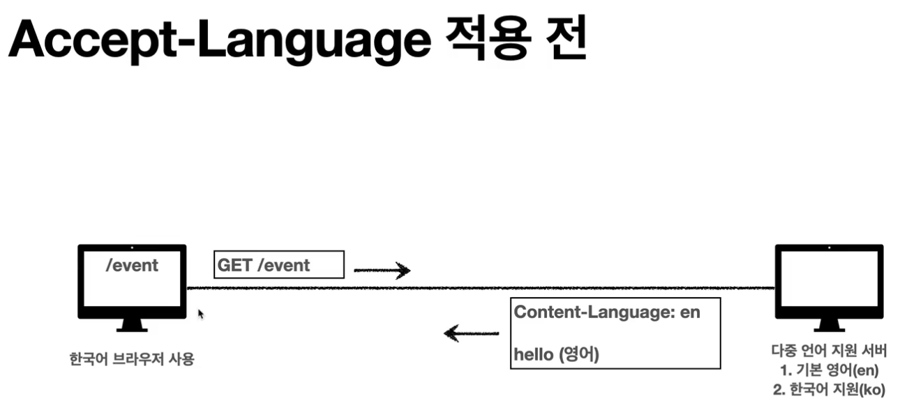
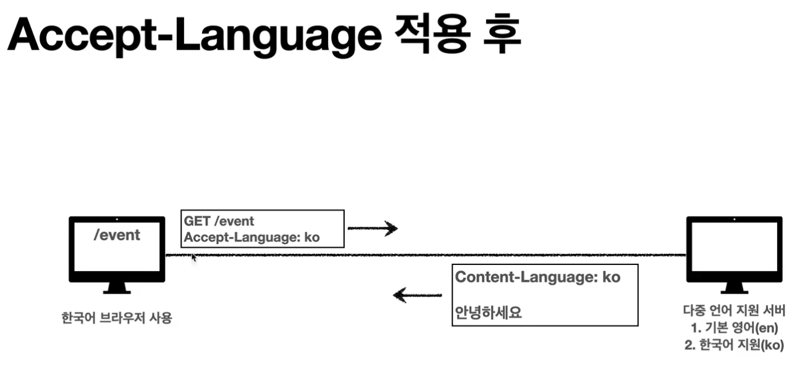
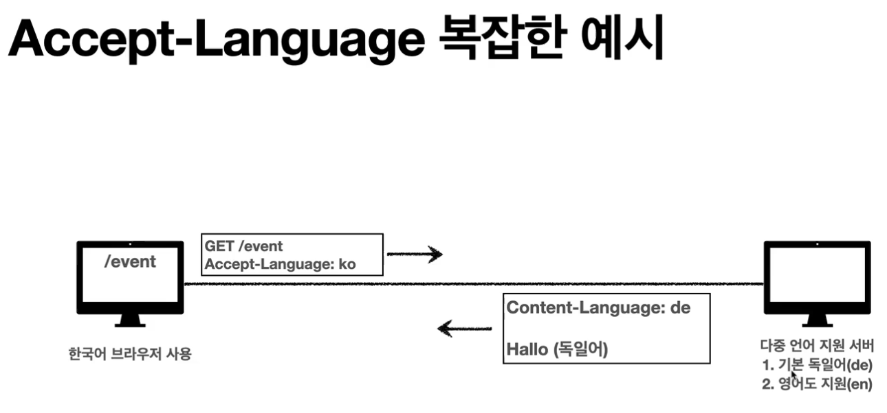
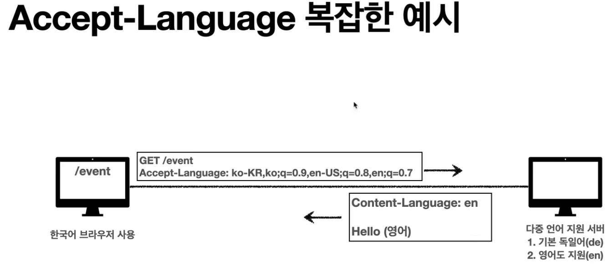

# HTTP Header

### 협상(콘텐츠 네고시에이션)

> 클라이언트가 원하는 표현으로 달라고 서버에 요청하는 것.

- Accept: 클라이언트가 선호하는 `미디어 타입 전달`
- Accept-Charset: 클라이언트가 선호하는 `문자 인코딩`
- Accept-Encoding: 클라이언트가 선호하는 `압축 인코딩`
- Accept-Language: 클라이언트가 선호하는 `자연 언어`

<br>

- 협상 헤더는 요청시에만 사용함.

<br>

### 협상 Accept Language 예시

한국어브라우저 사용하고, 외국 이벤트 사이트에 들어갔다고 가정해보자.



- 외국 이벤트 사이트는 다중언어를 지원해준다.
- 외국 이벤트 사이트는 기본적으로 영어를 지원, 단 한국어도 지원한다.
- 하지만, 클라이언트에서 서버로 보낼 때, Accept-Language 헤더가 없다면, 영어로 응답을 해줄 것.

<br>



- Accept-Language 헤더를 넣어서 보내면, 한국어로 응답을 해줄 것.

<br>



- 위 예시는 기본 독일어를 지원해준다.
- 하지만, 클라이언트에서 서버로 요청을 할 때, Accpet-Language 헤더에 `ko-KR`을 넣어서 보내면, 한국어지원이 없기 때문에 기본 독일어로 응답을 해줄 것.
- 그래서 이땐 우선순위가 필요하다.

<br>

```
Quality Values(q) 값을 사용한다
- 0~1, 클수록 높은 우선순위
- 생략하면 1
- Accept-Language: ko-KR,ko;q=0.9,en-US;q=0.8,en;q=0.7
  - ko-KR;q=1 (q생략)
  - ko;q=0.9
  - en-US;q=0.8
  - en;q=0.7
```

- 이렇게 정해 준 뒤, 요청을 보내면 우선순위에 따라 응답을 해줄 것.



- 위 예시에선 Accept-Language 우선순위가 정해져있다.

* 요청받은 사이트(이벤트사이트)의 기본 독일어를 지원하지만, 독일어 우선순위는 클라이언트 기준 0.7에 속해있지 않음
* 요청받는 사이트(이벤트사이트)에서 영어를 지원하는데, 클라이언트 기준 0.9에 속해있기 때문에 영어로 응답을 해준다.

<br>

### 협상 Accept 예시

```
구체적인 것이 우선된다.
- Accept: text/*, text/plain, text/plain;format=flowed, */*
```

- 위 요청의 우선순위는 다음과 같다
  1. text/plain;format=flowed
  2. text/plain
  3. text/\*
  4. \*/\*

<br>
