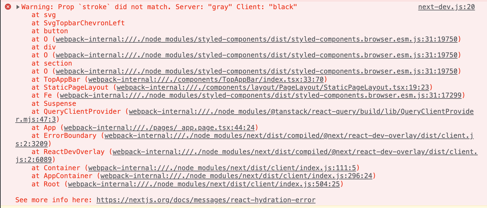

# NextJS

### className did not match



-

```TSX
const TopAppBar = () => {
  const router = useRouter();
  const [forwardCount, setForwardCount] = useState(0);

  useEffect(() => {
    if (!sessionStorage.getItem('initialURL')) {
      sessionStorage.setItem('initialURL', window.location.href);
    }
  }, []);

  const goBack = () => {
        //...
  };

  const goForward = () => {
        //...
  };

  const canGoBack =
    isBrowser() &&
    window.location.href !== sessionStorage.getItem('initialURL');
  const canGoForward = forwardCount > 0;

  return (
    <Wrapper>
      <Container>
        <Chevron onClick={goBack} disabled={!canGoBack}>
          <ChevronLeft stroke={canGoBack ? 'black' : 'gray'} />
        </Chevron>

        <Chevron onClick={goForward} disabled={!canGoForward}>
          <ChevronRight stroke={canGoForward ? 'black' : 'gray'} />
        </Chevron>
      </Container>
    </Wrapper>
  );
};

export default TopAppBar;
```

- 위와 같이 작성하고 난 이후 스크린샷처럼 에러가 떴다.
- svgr이라는 lib를 사용했는데, svg파일을 컴포넌트화 해준다.
  - 여기서 stroke를 Props로 내려주는데, server에서와 client의 stock가 맞지 않는 듯했다.
- ssr로 받은 html과 hydration되고 난 이후과 일치하지 않아서 생긴 오류인 것 같다.

<br>

```TSX
const router = useRouter();
  const [mounted, setMounted] = useState(false);

  useEffect(() => {
    if (!sessionStorage.getItem('initialURL')) {
      sessionStorage.setItem('initialURL', window.location.href);
    }

    setMounted(true);
  }, []);


  const canGoBack =
    mounted && window.location.href !== sessionStorage.getItem('initialURL');
```

- useEffect를 통해 TopAppBar가 mount되면 true로 변경시켜주고 canGoBack 조건을 추가해주었다.
- 이제 mount되었을 때 canGoBack이 읽혀서 warning이 뜨지 않는다.

<br>

### 참고자료

[[Next.js] Next.js에서 Prop `className` did not match 경고가 뜨는 이유](https://tesseractjh.tistory.com/164)
