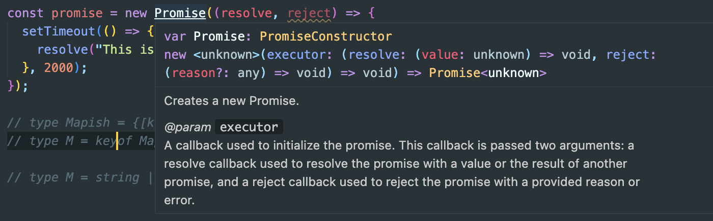
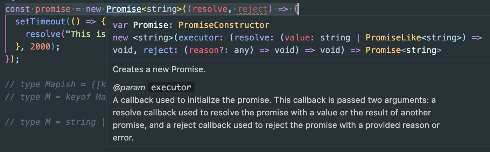

# Typescript

## 제네릭

> Understring typescript.94

```TS
const names: Array<string> = []; // string[]와 동일함.
names[0].split(" "); // string 메서드 사용이 편함

// Promise
const promise = new Promise((resolve, reject) => {
  setTimeout(() => {
    resolve("This is done");
  }, 2000);
});
```

- 프로미스 상수는 사실 프로미스 타입이라는 특정 타입을 지님



- 캡처 사진에서 확인 할 수 있듯이 unknown 타입을 지니게 되는데, resolve는 일단 문자열을 반환하므로 다음과 같이 작성해줄 수 있음

<br>

```TS
const promise: Promise<string> = new Promise((resolve, reject) => {
  setTimeout(() => {
    resolve("This is done");
  }, 2000);
});
```



- 근데 여기서 `Promise<any>`로 타입을 매겼을 경우 promise 콜백으로 then을 작성할 때 인자 값의 타입이 지정되어 있지 않음.

```TS
promise.then(data => {
    data. // dot 찍었을 때 any일 경우 메서드 참조가 안됨.
 })
```
