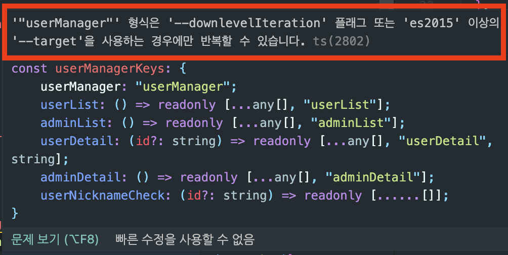

# TypeScript

### tsconfig, downlevelIteration

> 실수를 통해 배우다.

- 애초에 잘못된 코드를 작성했었다.

```TSX
export const userManagerKeys = {
  // 올바르게 작성
  userManager: ['userManager'] as const,
  userList: () => [...userManagerKeys.userManager, 'userList'] as const,


  // 잘못된 작성
  userManager: 'userManager' as const,
  userList: () => [...userManagerKeys.userManager, 'userList'] as const,
};
```

- 잘못된 작성을 했을 때 다음과 같은 에러가 떴다.



- 여기서 tsconfig.json에 다음과 같은 속성을 추가하면 문제가 없어진다.

```
// tsconfig.json
downlevelIteration: true
```

- 이 속성은 이전 버전의 자바스크립트로 트랜스파일링하는 것을 가리키는 타입용어인데, 이 속성을 사용하면 최신 자바스크립트가 아닌 이전 자바스크립트 런타임에서 새로운 개념을 통해 반복하는 방식을 보다 정확히 구현할 수 있게 해준다.
- 예를 들어 Set<T> 혹은 Map<T> 객체는 ES6에서 추가된 객체인데, tsconfig.json에 target을 ES5로 설정한 상태에서 Set<T>을 열거하려고 하면 오류가 발생한다
- 여기서 궁금한게, 나는 target 속성을 ES5로 사용하고 있었고, 스프레드 문법을 사용했는데, 배열로 스프레드 문법을 사용하면 에러가 나지 않고, 문자열로 스프레드 문법을 사용하면 에러가 난다.

<br>

- [이 블로그에서 답을 찾을 수 있었다.](https://mariusschulz.com/blog/downlevel-iteration-for-es3-es5-in-typescript#iterating-over-strings-using-for-of)
- 여기에서 문자열의 길이 속성과 문자열 이터레이터가 생성한 시퀀스의 길이가 차이나는 것을 알 수 있다.
- ES3 또는 ES5를 대상으로 문자열을 반복하는 것이 항상 올바르게 동작하는 것이 아니다.
- 다시말해 문자열로 for..of 또는 스프레드를 사용했을 때 정교하게 돌아가지 않는 듯하다. 그리고 정교하게 돌아가도록 만들어주는 것이 `downlevelIteration` 속성이다.
- 그리고 `downlevelIteration`를 추가하면 컴파일 했을 때 코드량이 증가한다.(더 정교하기 때문에.)

<br>

### 참고자료

[Downlevel Iteration -downlevelIteration](https://www.typescriptlang.org/tsconfig#downlevelIteration)

[[Typescript] --downlevelIteration](https://points.tistory.com/106)

[Why `downlevelIteration` is not on by default?](https://stackoverflow.com/questions/53441292/why-downleveliteration-is-not-on-by-default)

[Downlevel Iteration for ES3/ES5 in TypeScript](https://mariusschulz.com/blog/downlevel-iteration-for-es3-es5-in-typescript#iterating-over-strings-using-for-of)
