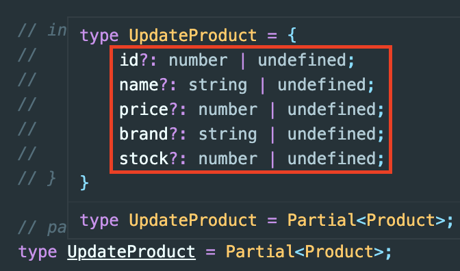

# TypeScript

## Partial

> interface를 하나 선언해놓고, interface안에 타입들을 옵셔널로 사용하고 싶은 경우 Partial을 사용해보기

<br>

```TSX
interface Product {
  id: number;
  name: string;
  price: number;
  brand: string;
  stock: number;
}

// 특정 상품정보를 업데이트 하는 함수
function upDateProductItem(productItem: Partial<Product>) {}
```



- `Partial`을 이용하면 다음과 같이 interface에 선언된 type들을 옵셔널로 적용해볼 수 있음

<br>

## Partial의 적용과정

1. 재활용해보기

```TSX
// 기존에 선언된 UserProfile
interface UserProfile {
  username: string;
  email: string;
  profilePhotourl: string;
}

// 재활용해보기
// UserProfile에 key값에 접근해서 value를 탐색
type UserProfileUpdate = {
  username?: UserProfile["username"];
  email?: UserProfile["email"];
  profilePhotourl?: UserProfile["profilePhotourl"];
};
```

2. 축약과정

```TSX
type UserProfileUpdate = {
  username?: UserProfile["username"];
  email?: UserProfile["email"];
  profilePhotourl?: UserProfile["profilePhotourl"];
};


// 반복문을 탄다고 보면 됨, username부터 profilePhotourl까지 반복문, 반복문 돌면서 옵셔널(?) 추가해줌
type UserProfileUpdate = {
  [p in "username" | "email" | "profilePhotourl"]?: UserProfile[p];
};
// 이게 Mapped Type이라고 함(공식문서) )
```

3. keysfo 적용

```TSX
type UserProfileKeys = keyof UserProfile;
// UserProfileKeys = username, email, profilePhotourl


// 2번을 keysof을 이용해서 한번 더 축약함.
type UserProfileUpdate = {
  [p in keyof UserProfile]?: UserProfile[p];
};
```

4. Partial 구현

```TSX
// 이게 partial 구현모습
type Subset<T> ={
  [p in keyof <T>]?: T[p];
}
```

- keyof 뒤에 UserProfile만 제네릭으로 받아줌

<br>

결과적으로 다음과 같이 사용가능

```TSX
function upDateProductItem(productItem: Partial<Product>) {}
```
