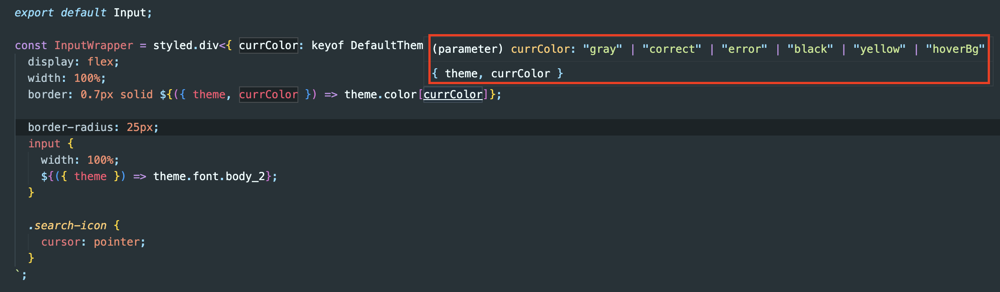

# Typescript

## key값은 string이 아닌 상수임.

> 정정하자면 string이 아니라 Literal type.

```TSX
<InputWrapper currColor={currColor} style={style}>
  <input
    onBlur={handleOnBlur}
    onFocus={handleOnFocus}
    type={type}
    value={inputValue}
    onChange={handleOnChange}
    placeholder={placeHolder}
  />
</InputWrapper>
```

- 다음과 같이 작성된 코드가 있고, event에 따라 해당 currColor state가 변경되어 props으로 내려준 뒤 border color를 변경시켜줌.
- 이때 type을 어떻게 매겨야할지 애매함.

<br>

## 처음 매겼던 타입

```TSX
// Input.tsx
const InputWrapper = styled.div<{ currColor: string }>`
  border: 0.7px solid ${({ theme, currColor }) => theme.color[currColor]};
`;
```

- 이렇게 매겼을 때 당연히 에러가 발생했음.
- 해당 currColor는 key값으로 사용되고 있는데 key값의 타입은 string이 아닌 ~~`상수`~~ `(literal type)`이 였음
- 그래서 keyof를 이용해서 key값을 불러와서 타입을 지정해줌.

<br>

## keyof 적용

```TSX
// theme.ts
export const theme: DefaultTheme = {
  color: {
    black: '#000000',
    gray: '#999999',
    error: '#ff5858',
    correct: '#4498F2',
    yellow: '#ffdc3c',
    hoverBg: '#eeeeee',
  }
}

// Input.tsx
const InputWrapper = styled.div<{ currColor: keyof DefaultTheme['color'] }>`
  border: 0.7px solid ${({ theme, currColor }) => theme.color[currColor]};
`;
```

- keyof를 이용해서 DefaultTheme의 color에 해당하는 key를 모두 가져옴



- 스크린샷처럼 key값을 모두 가져와서 타입으로 사용할 수 있음.

<br>

## literal type

```TS
const a = "Hello World"
let b = "Hello World"
const c: string = "Hello World"
```

- 위 세개의 변수 타입은 각각 다음과 같음

```TS
type HelloWorldType = "Hello World" // literal type

let a: HelloWorldType = "Hello World" // ok
a = "hahaha" // compile error: "hahaha"는 "Hello World"가 아니기 때문.
```

<br>

### 참고자료

[Keyof Type Operator](https://www.typescriptlang.org/docs/handbook/2/keyof-types.html)

[TypeScript에서 string key로 객체에 접근하기](https://soopdop.github.io/2020/12/01/index-signatures-in-typescript/#chip)

- 예시 참고했음

[Literal Types](https://www.typescriptlang.org/docs/handbook/2/everyday-types.html#literal-types)

- 공식문서
