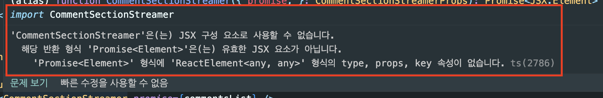

### Next.JS server components

```TSX
return(
    <Suspense fallback={<Loading />}>
        {/* @ts-expect-error Async Server Component */}
        <CommentSectionStreamer promise={commentsList} />
    </Suspense>
)
```

- 해당 부분은 아직 Typescript에 반영되지 않은 듯 하다.
  - 다음과 같은 에러가 뜬다.



[async and await in Server Components](https://nextjs.org/docs/app/building-your-application/data-fetching/fetching#async-and-await-in-server-components)

[# Async 서버 컴포넌트 Promise 반환 이슈](https://curryyou.tistory.com/529)

<br>

### vercel build error

```
Type error: File name '/vercel/path0/app/loading.tsx' differs from already included file name '/vercel/path0/app/Loading.tsx' only in casing.
```

- Loading.tsx를 loading.tsx로 변경하려고 했는데 위와 같은 에러가 발생했다.

<br>

- 위 에러는 vercel build시에 뜨는 에러이다.
  - tsconfig.json을 수정해서 에러를 해결하려 했으나 실패했다.
  - 결국 loading.tsx / Loading.tsx를 모두 삭제하고 loading.tsx를 다시 추가해주니 해결됐다.

[File differs from already included file only in casing: correct casing but relative path](https://github.com/microsoft/TypeScript/issues/25460)

[How do I resolve a 'module not found' error?](https://vercel.com/guides/how-do-i-resolve-a-module-not-found-error)

### vercel build error

```
Type error: File name '/vercel/path0/app/loading.tsx' differs from already included file name '/vercel/path0/app/Loading.tsx' only in casing.
```

- Loading.tsx를 loading.tsx로 변경하려고 했는데 위와 같은 에러가 발생했다.

<br>

- 위 에러는 vercel build시에 뜨는 에러이다.
  - tsconfig.json을 수정해서 에러를 해결하려 했으나 실패했다.
  - 결국 loading.tsx / Loading.tsx를 모두 삭제하고 loading.tsx를 다시 추가해주니 해결됐다.

[File differs from already included file only in casing: correct casing but relative path](https://github.com/microsoft/TypeScript/issues/25460)

[How do I resolve a 'module not found' error?](https://vercel.com/guides/how-do-i-resolve-a-module-not-found-error)
