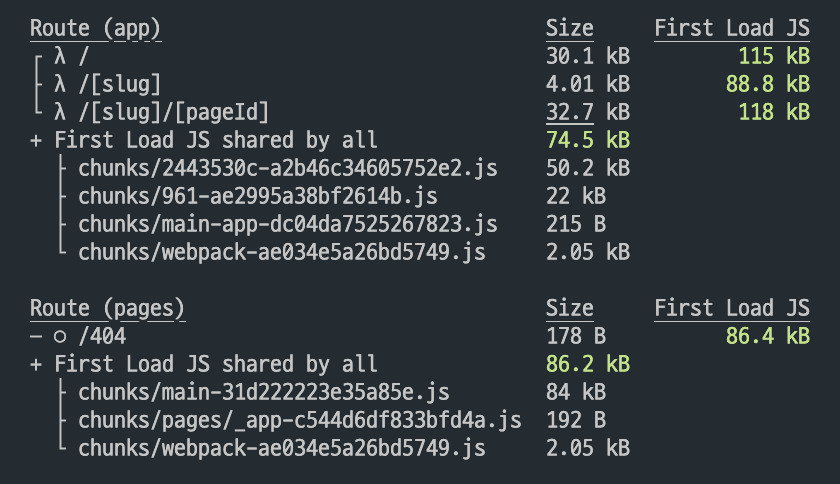

### next 13 app Directory

<br>

```TSX
const getInstagramFeedIds = async (): Promise<InstagramFeedProps[]> => {
  const url = `https://graph.instagram.com/me?fields=media&access_token=${process.env.INSTAGRAM_KEY}`;
  const response = await fetch(url, { next: { revalidate: 30 } });
  const feed = await response.json();

  if (!response.ok) {
    throw new Error(feed.error.message);
  }

  return feed.media.data;
};
```

- next 13에선 getStaticProps, getServerSideProps 등을 사용할 수 없다.
- 대신, fetch로 api를 바로 쏘면 된다. client 환경으로 변경하려면 'use client'를 맨 위에 적어주면 된다.

<br>

### revalidate

- revalidate를 설정하지 않은 상태에서 insta feed를 올리니, 데이터가 업데이트 되지 않았다.
- 캐싱된 데이터를 그대로 사용하다가 일정 시간이 지나면 캐싱된 데이터를 무효화하고 새롭게 데이터를 가져오는 것 같다.
- 그래서 revalidate Time을 다음과 같이 설정해준 뒤 신선한 데이터를 가져올 수 있었다.

```TSX
const getInstagramFeeds = async (id: string): Promise<any> => {
  const url = `https://graph.instagram.com/${id}?fields=media_type,media_url,timestamp,permalink&access_token=${process.env.INSTAGRAM_KEY_JEJODO}`;

  const response = await fetch(url, {next: {revalidate: 60}});
  const feed = await response.json();

  if (!response.ok) {
    throw new Error(feed.error.message);
  }

  return feed;
};
```

<br>

- 하지만 현재는 layout.tsx에 다음과 같이 지정해준 상태다.

```TSX
export const revalidate = 3600;
export const dynamic = 'force-static';
```

<br>

- dynamic이라는게 있는데 공식문서 설명은 다음과 같다.

```TSX
export const dynamic = 'auto'
// 'auto' | 'force-dynamic' | 'error' | 'force-static'
```

- 해당 속성은 공식문서에 자세히 나와있다.
- 내가 사용하려고 했던 것은 force-static이다. 정적 블로그 사이트를 배포해야하기 때문에 실시간으로 데이터를 fetch 할 필요가 없었다.
- 또한, 실시간으로 데이터를 fetch하면 페이지와 페이지 사이의 전환이 너무 느렸다.
- force-static으로 정적페이지가 빌드되도록 했다.
  - 여기서 error와 force-static은 같은 정적페이지를 만드는데. 둘의 큰 차이는 모르겠다.

<br>



- force-dynamic
- λ가 있는데, 동적페이지를 의미하는 듯 하다.


- force-static
- o는 정적페이지를 의미하는 듯 하다.

<br>

### 참고자료

- [Revalidating Data](https://beta.nextjs.org/docs/data-fetching/revalidating)
- [dynamic](https://beta.nextjs.org/docs/api-reference/segment-config#dynamic)
